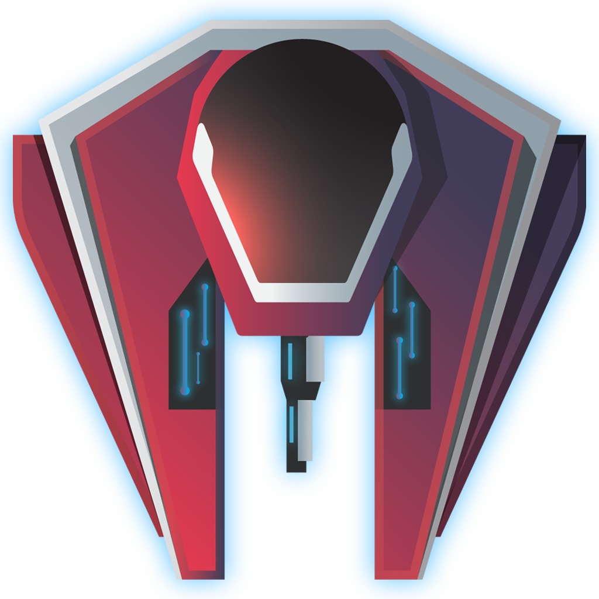

# Guardian-Starship &middot; 

       
<!--  -->
 
 

>#### .
>#### .

## Developing

### Built Unity
2020.3.32f1 versions used.

## Versioning

 For the versions available, see the [https://unity.com/releases/editor/whats-new/2020.3.32](/tags).

# Screenshots

<table>
   <tr>
      <td></td>
      <td></td>
      <td></td>
      <td></td>
   </tr>